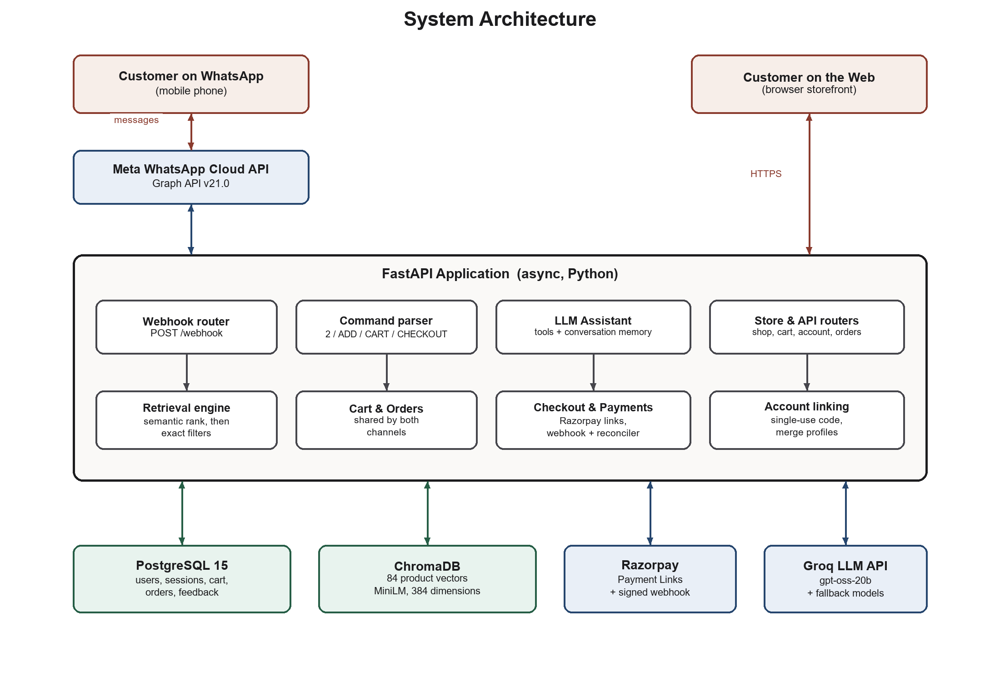

# Munim

A WhatsApp shopping assistant for clothing brands. A customer messages the brand's
WhatsApp number in their own words ("something for a haldi, around 5k"), and Munim
answers with real products, photos, prices and stock from the brand's catalogue. It
keeps a cart and takes the customer to checkout, then tells them about their order.

Munim began as a college minor project (graded, September 2026) with one demo shop of
Indian ethnic wear. It is now becoming a multi-brand product. The first pilot is a
Shopify store selling T-shirts and workout clothes. [plan.md](plan.md) holds the roadmap
(phases P0–P7) and the decision log.

> The demo shop's 84 products and brands are invented. Product photos are from Pexels.

## What it does today

- **Chat that finds things.** An LLM with tools asks one or two questions when a request
  is vague, then searches. Retrieval ranks by meaning (vector search), then applies hard
  filters for gender, category, budget and stock in code.
- **Code writes every fact.** Product lists, prices, cart contents, totals and the Pay
  button are built by code, never written by the model. Tools are bound to the sender,
  so one customer cannot see another's orders.
- **Cart and checkout on both channels.** WhatsApp (`ADD`, `CART`, `CHECKOUT`, or plain
  words) and a web storefront share one cart. Payment runs through Razorpay (test mode),
  confirmed by a signed webhook and a background reconciler.
- **After the sale.** Order tracking, "buy it again", address capture in chat, and
  WhatsApp confirmation of website orders once the account is linked.
- **Owner training.** The shop owner rates answers on `/admin/training`. Ratings re-rank
  products for similar questions and become examples or rules in the prompt.

## Architecture

Today's system (one shop):



Payments have since moved from Razorpay Payment Links to Standard Checkout (Razorpay
orders plus our own `/pay/{order_id}` page).

Where it is going (see [plan.md](plan.md#architecture-target)): several stores, each
with its own WhatsApp number, behind a `CommerceConnector` (Shopify first). Products and
their vectors move into Postgres with pgvector, which retires ChromaDB.

```
 WhatsApp (per-brand number) ─┐                ┌─ ShopifyConnector (Admin GraphQL + webhooks, Storefront cart)
 Brand dashboard ─────────────┼→ Munim core ←──┼─ FeedConnector    (demo brand; later Google Merchant feeds)
 Web chat widget (later) ─────┘   (per store)  └─ WooConnector / ApiConnector (later)
```

**Stack:** FastAPI (async Python), PostgreSQL 15 via SQLModel, ChromaDB with local MiniLM
embeddings, an OpenAI-compatible LLM API (Groq), WhatsApp Cloud API, Razorpay, Jinja
templates with compiled Tailwind.

## Quick start

Needs Python 3.13, Docker, and Node (for one test suite and rebuilding CSS).
The commands are for Git Bash on Windows; on macOS/Linux use `.venv/bin/` instead of
`.venv/Scripts/`.

```bash
# 1. Databases: Postgres on 5432, ChromaDB on 8001
docker compose up -d

# 2. Python environment
python -m venv backend/.venv
backend/.venv/Scripts/pip install -r backend/requirements.txt

# 3. Settings: copy the example and fill it in (each key is explained there)
cp backend/.env.example backend/.env

# 4. Put the catalogue into ChromaDB (re-run after editing data/products.json)
backend/.venv/Scripts/python scripts/ingest_catalog.py

# 5. Run the app: storefront at http://localhost:8000
cd backend && .venv/Scripts/uvicorn main:app --reload --port 8000
```

The storefront, cart and checkout work with only steps 1–5. For the bot you also need:

- **An LLM key.** Set `LLM_API_KEY` (a Groq key works). Without it (or `OPENAI_API_KEY`), the bot answers with
  plain search instead of the conversational assistant.
- **WhatsApp.** A Meta app with the WhatsApp product, its token and phone number id in
  `.env`, and a public URL for the webhook (`ngrok http 8000`, then set
  `<url>/webhook` and your `WHATSAPP_VERIFY_TOKEN` in the Meta dashboard). The test
  number can only message the phones listed in the dashboard.
- **To try a conversation without a phone:** `scripts/simulate_webhook.py`.

## Tests

One command runs every suite (cart, assistant, payments, store, training, live sync,
linking, the browser-side live.js) and the retrieval eval. It needs the Docker services
running.

```bash
backend/.venv/Scripts/python scripts/run_all_tests.py             # everything, ~1.5 min
backend/.venv/Scripts/python scripts/run_all_tests.py cart live   # just these
backend/.venv/Scripts/python scripts/run_all_tests.py -v          # full output
```

The suites use fake WhatsApp, Razorpay and LLM clients, so they spend no quota and send
nothing. They share the development database and clean up only the rows they create.

## Repo layout

```
backend/           FastAPI app (run from here)
  main.py          app, lifespan (payment reconciler), static files
  routers/         webhook (WhatsApp), store + browse + api (website), payments, admin
  bot/             assistant.py (LLM + tools), retrieval.py (search engine), chat.py (plain fallback)
  models.py, db.py, repository.py   Postgres schema and queries
  checkout.py, payments.py          orders and Razorpay
  templates/, static/, tailwind/    storefront
common/            shared schemas and the embeddings wrapper
data/products.json the demo catalogue (84 products)
scripts/           tests, eval, catalogue ingest, data export
evals/raw/         logged conversations and owner ratings (P2's eval set; local only, gitignored)
docs/              research notes, report, figures; docs/archive/ holds old plans
```

`CLAUDE.md` has the detailed engineering notes: why each piece works the way it does,
and what went wrong live.
